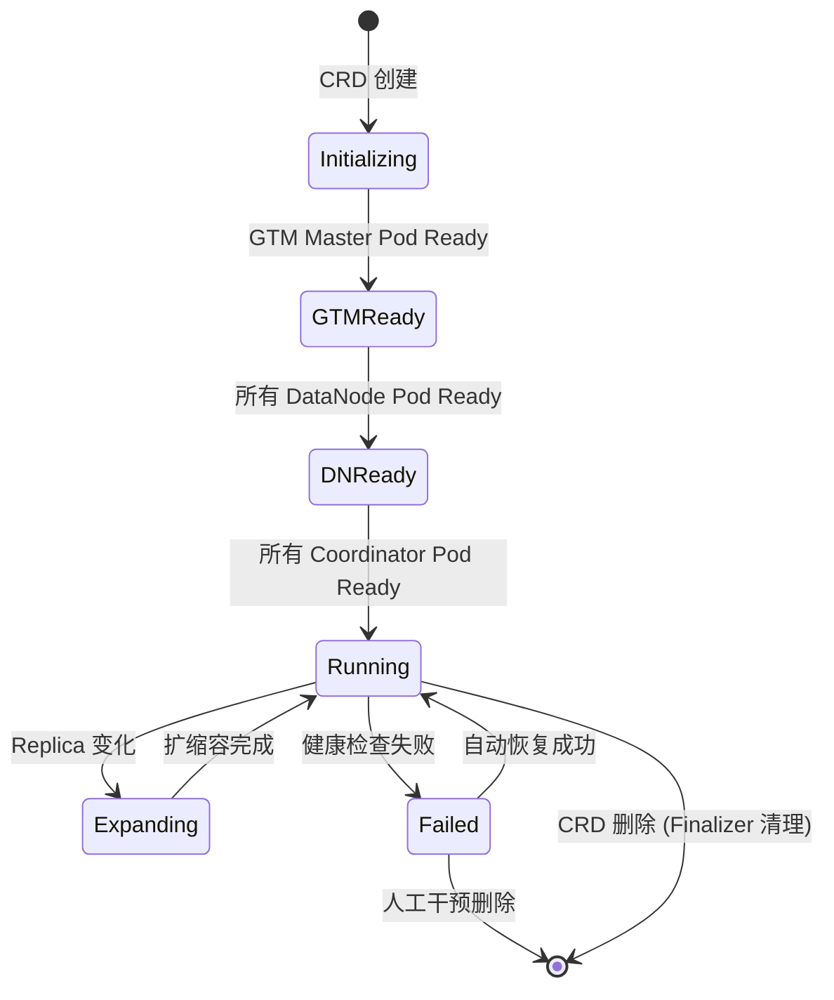

# OpenTenBase Operator Controller 伪代码

> 此文档描述 Operator 控制器的核心 Reconciler 逻辑。
> 实际实现时可选择 Go (Kubebuilder/controller-runtime) 或 Python (kopf)。

## 与 CNPG Reconciler 的对比

> 本节说明为什么自建 Reconciler 而非复用 CNPG 的，呼应 §4.4 的技术论证。

| 维度 | CNPG Reconciler | OpenTenBase Reconciler |
|------|----------------|------------------------|
| 角色 | 1 个（single PG instance） | 3 个（GTM + CN + DN） |
| 阶段数 | 2（primary → replica） | 5（Initializing → GTMReady → DNReady → Running → Expanding） |
| 启动依赖 | 无（单节点 bootstrap） | 严格顺序（GTM → DN → CN） |
| 节点注册 | 无（Patroni 自动发现） | 需 `CREATE NODE` SQL 注册 |
| failover | Patroni DCS 选举 | GTM standby promote + CN/DN 重连 |

CNPG 的 Reconciler 只需管理一个 StatefulSet + 一个 primary 选举，而 OpenTenBase 需要 3 个 StatefulSet + 跨组件注册编排 + GTM failover。复用 CNPG Reconciler 的收益为零——所有核心逻辑需要重写。

## 核心设计原则

1. **有序初始化**: GTM → DataNode → Coordinator，严格按顺序部署
2. **状态驱动**: 每次 reconcile 根据 `status.phase` 判断当前阶段，执行对应步骤
3. **幂等性**: 所有操作可安全重复执行（已完成的步骤自动跳过）
4. **最终一致性**: 失败操作通过 requeue 自动重试

---

## Reconciler 主循环

```go
// Reconcile 主入口 — 每次集群状态变更触发
func (r *OpenTenBaseClusterReconciler) Reconcile(ctx context.Context, req ctrl.Request) (ctrl.Result, error) {
    cluster := &opentenbasev1alpha1.OpenTenBaseCluster{}
    if err := r.Get(ctx, req.NamespacedName, cluster); err != nil {
        return ctrl.Result{}, client.IgnoreNotFound(err)
    }

    // 根据当前 Phase 执行对应阶段
    switch cluster.Status.Phase {
    case "", "Initializing":
        return r.reconcileGTM(ctx, cluster)
    case "GTMReady":
        return r.reconcileDataNodes(ctx, cluster)
    case "DNReady":
        return r.reconcileCoordinators(ctx, cluster)
    case "Running":
        return r.reconcileRunning(ctx, cluster)  // 健康检查 + 扩缩容
    case "Failed":
        return r.reconcileFailed(ctx, cluster)   // 错误恢复
    case "Expanding":
        return r.reconcileExpanding(ctx, cluster) // 扩缩容处理
    }
}
```

---

## 阶段 1: GTM 部署

```go
func (r *OpenTenBaseClusterReconciler) reconcileGTM(ctx, cluster) (Result, error) {
    // 1. 创建 GTM Master StatefulSet (init-container: k8s_init_script.sh ROLE=gtm-master)
    sts := buildGTMStatefulSet(cluster, "master")
    if err := r.CreateOrUpdate(ctx, sts); err != nil {
        return Result{RequeueAfter: 5s}, err  // 失败: 5 秒后重试
    }

    // 2. 等待 GTM Master Pod Ready
    if !isPodReady(ctx, r, cluster, "gtm-master") {
        updatePhase(ctx, r, cluster, "Initializing", "GTM Master deploying")
        return Result{RequeueAfter: 10s}, nil  // 未就绪: 10 秒后检查
    }

    // 3. 创建 GTM Standby (如果配置了)
    if cluster.Spec.GTM.Standby.Replicas > 0 {
        stsStandby := buildGTMStatefulSet(cluster, "standby")
        if err := r.CreateOrUpdate(ctx, stsStandby); err != nil {
            return Result{RequeueAfter: 5s}, err
        }
        if !isPodReady(ctx, r, cluster, "gtm-standby") {
            updatePhase(ctx, r, cluster, "Initializing", "GTM Standby deploying")
            return Result{RequeueAfter: 10s}, nil
        }
    }

    // 4. GTM 就绪 → 更新状态，进入下一阶段
    updatePhase(ctx, r, cluster, "GTMReady", "GTM ready, waiting for DataNodes")
    return Result{Requeue: true}, nil  // 立即触发下一阶段
}
```

---

## 阶段 2: DataNode 部署

```go
func (r *OpenTenBaseClusterReconciler) reconcileDataNodes(ctx, cluster) (Result, error) {
    // 1. 为每个 DN 创建 StatefulSet
    for i := 0; i < cluster.Spec.DataNodes.Replicas; i++ {
        sts := buildDNStatefulSet(cluster, i)
        if err := r.CreateOrUpdate(ctx, sts); err != nil {
            return Result{RequeueAfter: 5s}, err
        }
    }

    // 2. 等待所有 DN Pod Ready
    allReady := true
    for i := 0; i < cluster.Spec.DataNodes.Replicas; i++ {
        if !isPodReady(ctx, r, cluster, fmt.Sprintf("dn%d", i)) {
            allReady = false
        }
    }
    if !allReady {
        updatePhase(ctx, r, cluster, "GTMReady", "DataNodes deploying")
        return Result{RequeueAfter: 10s}, nil
    }

    // 3. DN 就绪 → 更新状态
    updatePhase(ctx, r, cluster, "DNReady", "DataNodes ready, waiting for Coordinator")
    return Result{Requeue: true}, nil
}
```

---

## 阶段 3: Coordinator 部署

```go
func (r *OpenTenBaseClusterReconciler) reconcileCoordinators(ctx, cluster) (Result, error) {
    // 1. 创建 CN StatefulSet
    for i := 0; i < cluster.Spec.Coordinators.Replicas; i++ {
        sts := buildCNStatefulSet(cluster, i)
        if err := r.CreateOrUpdate(ctx, sts); err != nil {
            return Result{RequeueAfter: 5s}, err
        }
    }

    // 2. 等待所有 CN Pod Ready
    for i := 0; i < cluster.Spec.Coordinators.Replicas; i++ {
        if !isPodReady(ctx, r, cluster, fmt.Sprintf("cn%d", i)) {
            updatePhase(ctx, r, cluster, "DNReady", "Coordinator deploying")
            return Result{RequeueAfter: 10s}, nil
        }
    }

    // 3. 创建 pgBouncer Deployment (如果配置了)
    if cluster.Spec.Coordinators.PgBouncer.Enabled {
        deploy := buildPgBouncerDeployment(cluster)
        if err := r.CreateOrUpdate(ctx, deploy); err != nil {
            return Result{RequeueAfter: 5s}, err
        }
    }

    // 4. 更新 connectionInfo (CN 就绪后可写入连接信息)
    updateStatus(ctx, r, cluster, "Running", "Cluster running", ConnectionInfo{
        Host: fmt.Sprintf("%s-cn0", cluster.Name),
        Port: 5432,
        Database: "postgres",
        User: "opentenbase",
    })
    return Result{RequeueAfter: 30s}, nil  // Running: 30 秒健康检查周期
}
```

---

## Running 阶段: 健康检查 + 扩缩容

```go
func (r *OpenTenBaseClusterReconciler) reconcileRunning(ctx, cluster) (Result, error) {
    // 1. 健康检查: 确认所有组件存活
    if !allComponentsHealthy(ctx, r, cluster) {
        updatePhase(ctx, r, cluster, "Failed", "Health check failed")
        return Result{Requeue: true}, nil
    }

    // 2. 监控组件状态变更
    // - DN replica count 变化 → 扩缩容
    // - CN replica count 变化 → 扩缩容
    if cluster.Spec.DataNodes.Replicas != len(getRunningPods(ctx, r, cluster, "datanode")) {
        updatePhase(ctx, r, cluster, "Expanding", "DataNode scaling")
        return Result{Requeue: true}, nil
    }

    // 3. 更新 nodeStatus (Pod 状态映射到 CRD status)
    updateNodeStatus(ctx, r, cluster)

    return Result{RequeueAfter: 30s}, nil  // 定期健康检查
}
```

---

## StatefulSet 构建模式

每个组件 (GTM/DN/CN) 的 StatefulSet 结构：

```
┌───────────────────────────────────┐
│  StatefulSet: {cluster}-gtm-master│
│  ┌───────────────────────────────┐│
│  │  init-container               ││
│  │  - ROLE=gtm-master            ││
│  │  - k8s_init_script.sh         ││
│  │  - 健康检查 + 超时 + 重试      ││
│  ├───────────────────────────────┤│
│  │  main-container               ││
│  │  - opentenbase:v5.21.8        ││
│  │  - GTM 进程                   ││
│  ├───────────────────────────────┤│
│  │  volume                       ││
│  │  - PVC: PGDATA                ││
│  │  - ConfigMap: gtm.conf        ││
│  └───────────────────────────────┘│
└───────────────────────────────────┘
```

---

## 状态流转图 (Mermaid)


