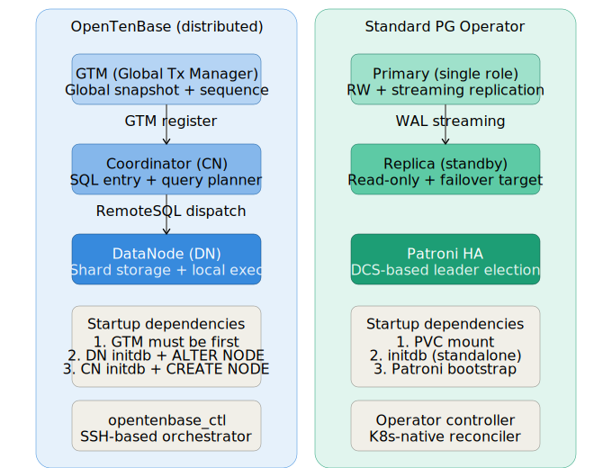
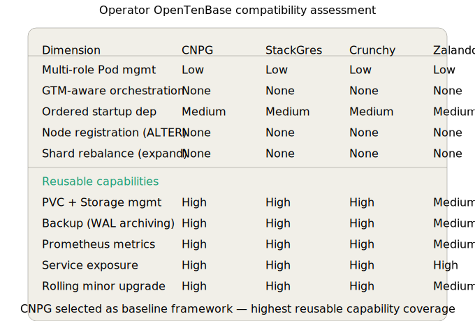
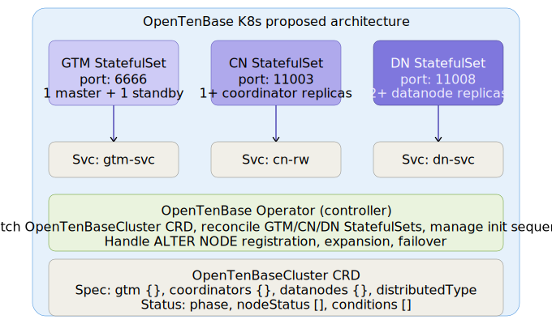
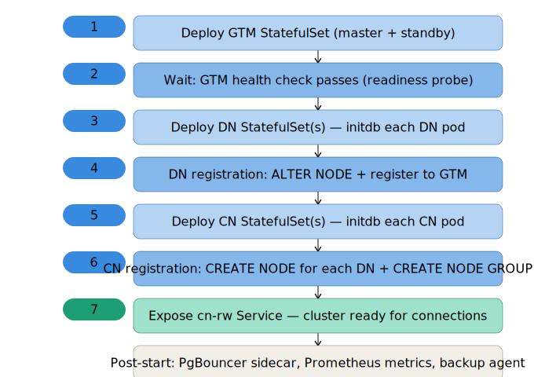

# OpenTenBase 接入分布式 PostgreSQL 社区部署框架方案设计

> 关联 Issue: #201 — 调研并设计接入分布式 PG 社区部署框架的方案
> 版本: v1.0-draft
> 日期: 2026-06-30

---

## 目录

1. [背景与动机](#1-背景与动机)
2. [OpenTenBase 部署架构分析](#2-opentenbase-部署架构分析)
3. [社区 PG Operator 框架对比调研](#3-社区-pg-operator-框架对比调研)
4. [关键差异分析](#4-关键差异分析)
5. [接入可行性方案](#5-接入可行性方案)
6. [OpenTenBaseCluster CRD 设计草案](#6-opentenbasecluster-crd-设计草案)
7. [初始化编排流程](#7-初始化编排流程)
8. [可复用与需新建能力清单](#8-可复用与需新建能力清单)
9. [分阶段实施路线图](#9-分阶段实施路线图)
10. [风险与待讨论项](#10-风险与待讨论项)

---

## 1. 背景与动机

### 1.1 问题陈述

OpenTenBase 作为分布式 PostgreSQL 扩展，当前部署方式依赖 **opentenbase_ctl** —— 一个基于 SSH 的编排工具，需要手动在各节点上执行命令完成 GTM/CN/DN 的初始化和注册。这种方式存在以下痛点：

- **操作门槛高**：需要用户掌握 GTM/CN/DN 的启动顺序、配置文件格式、节点注册 SQL
- **运维自动化不足**：无法自动故障恢复、弹性扩缩容、滚动升级
- **部署环境受限**：SSH 模式仅适用于物理机/VM，无法在 Kubernetes 上声明式部署
- **与社区生态脱节**：主流 PG Operator（CloudNativePG、StackGres 等）已建立完善的 K8s 部署范式，OpenTenBase 无法复用这些生态

### 1.2 目标

设计一个 OpenTenBase Kubernetes Operator 方案，使得：

- 用户通过一个 YAML 文件即可声明完整的分布式集群（GTM + CN + DN）
- Operator 自动处理启动依赖、节点注册、健康检查、故障恢复
- 复用社区 PG Operator 的成熟模式（Sidecar 监控、WAL 备份、PVC 管理）
- 保持 OpenTenBase 分布式架构的独特能力（跨 DN 查询、GTM 全局事务）

---

## 2. OpenTenBase 部署架构分析

### 2.1 三角色架构

OpenTenBase 在分布式模式下有三个核心角色，每个角色是独立的 PostgreSQL 进程，运行不同的二进制：

| 角色 | 二进制 | 默认端口 | 核心职责 | 进程模型 |
|------|--------|----------|----------|----------|
| **GTM** (Global Transaction Manager) | `gtm` / `gtm_proxy` | 6666 (GTM) / 6667 (Proxy) | 全局快照、事务ID分配、序列号管理 | 单进程，无共享内存 |
| **Coordinator** (CN) | `postgres` (pgxc模式) | 5432 | SQL 入口、查询规划、跨 DN 调度 | 标准 PG 进程模型 |
| **DataNode** (DN) | `postgres` (pgxc模式) | 5432 + 唯一节点号 | 分片存储、本地查询执行 | 标准 PG 进程模型 |

### 2.2 启动依赖与注册流程

OpenTenBase 的集群初始化有严格的顺序依赖，这是与单机 PG 最大的架构差异：



**初始化序列（当前 opentenbase_ctl 方式）：**

```
Step 1: initgtm → 启动 GTM Master (监听 6666)
Step 2: initgtm → 启动 GTM Standby (可选，连接 Master 同步)
Step 3: initdb + pg_ctl start → 启动每个 DN
        每个 DN 执行: ALTER NODE dn_x WITH (type='datanode', port=5432)
Step 4: initdb + pg_ctl start → 启动 CN
        CN 执行: CREATE NODE dn_1 (type='datanode', host='dn1', port=5432)
        CN 执行: CREATE NODE dn_2 (type='datanode', host='dn2', port=5432)
        CN 执行: ALTER NODE cn_1 WITH (type='coordinator', port=5432)
```

关键约束：
- **GTM 必须最先启动**，所有 CN/DN 注册时需要连接 GTM
- **DN 必须在 CN 之前完成注册**，CN 创建节点引用时需要 DN 已就绪
- **节点注册是集群级别的操作**，不是单节点 initdb 就够了

### 2.3 现有部署方式

| 方式 | 位置 | 机制 | 局限 |
|------|------|------|------|
| **opentenbase_ctl** | `contrib/opentenbase_ctl/` | SSH + Shell 脚本 | 手动编排，无自动恢复 |
| **Docker Compose** | `docker/host/` | 多容器编排 | 仅限开发测试，无生产运维 |
| **KubeBlocks Dockerfile** | `docker/k8s_support/` | 纯二进制镜像 | 无 entrypoint，未完成 K8s 化 |

---

## 3. 社区 PG Operator 框架对比调研

### 3.1 四大框架概览

| 维度 | CloudNativePG | StackGres | Crunchy PGO | Zalando PGO |
|------|---------------|-----------|-------------|-------------|
| **GitHub Stars** | ~4.5K | ~500 | ~1.5K | ~3.5K |
| **核心 CRD** | `Cluster` | `SGCluster` | `PostgresCluster` | `postgresql` |
| **Pod 模型** | Primary+Replica 独立 Pod | Sidecar 模式（1 Pod 多容器） | 独立 Pod | 独立 Pod + Spilo 容器 |
| **HA 方案** | Patroni 内嵌 | Patroni Sidecar | Patroni | Patroni (Spilo) |
| **备份** | Barman Cloud | pgBackRest | pgBackRest | WAL-G |
| **监控** | 内置 pg_stat_statements exporter | Prometheus Sidecar | exporter Sidecar | exporter Sidecar |
| **存储** | PVC + StorageClass | PVC + StorageClass | PVC + StorageClass | PVC + StorageClass |
| **连接池** | PgBouncer (内置 CRD) | PgBouncer (内置) | PgBouncer (可选) | 无内置 |
| **升级** | 原地滚动更新 | 原地 + 滚动 | 原地 + 滚动 | 原地 + 滚动 |
| **许可证** | Apache 2.0 | AGPL 3.0 | Apache 2.0 | Apache 2.0 |
| **厂商背书** | EDB (EnterpriseDB) | OnGres | CrunchyData | Zalando |



### 3.2 CloudNativePG 深度分析（推荐对标框架）

CloudNativePG（CNPG）是目前最活跃的 PG Operator，以下是其核心设计模式：

**CRD 结构（Cluster v1）：**
```yaml
apiVersion: postgresql.cnpg.io/v1
kind: Cluster
spec:
  imageName: postgres:16
  instances: 3           # Primary + 2 Replica
  storage:
    size: 10Gi
    storageClass: standard
  backup:
    barmanObjectStore: ...
  monitoring:
    enabled: true
```

**核心编排模式：**
1. **单 CRD 表达完整集群** — 一个 `Cluster` 资源包含 Primary + 所有 Replica
2. **StatefulSet 管理 Pod** — 使用 `ordinal` 确保有序启动
3. **Patroni Sidecar 内嵌** — 每个 PG Pod 中包含 Patroni 进程，通过 DCS（K8s ConfigMap）选举 leader
4. **InitContainer 做初始化** — initdb、恢复、join existing cluster
5. **Readinessprobe 检查 Patroni 状态** — 确保只有 ready 的 Pod 被加入 Service

---

## 4. 关键差异分析

### 4.1 OpenTenBase vs 单机 PG Operator 的核心差异

| 差异维度 | 单机 PG Operator | OpenTenBase | 影响 |
|----------|-----------------|-------------|------|
| **角色数量** | 1（Primary/Replica 同角色） | 3（GTM/CN/DN） | 需要管理 3 种 StatefulSet |
| **启动依赖** | 无（initdb 即可独立运行） | 有（GTM→DN→CN 顺序） | 需要阶段化编排控制器 |
| **节点注册** | 无（每个实例独立） | 有（CN 注册 DN、DN 注册 GTM） | 需要 init SQL hook |
| **全局事务** | 无（本地 MVCC） | 有（GTM 分配 GXID） | GTM 单点故障需 standby |
| **数据分片** | 无（单实例存储） | 有（Hash/Modulo/Shard/Replication） | DN 扩缩容需 re-shard |
| **查询路由** | 无（本地执行） | 有（CN → Remote SQL/Broadcast） | CN 路由表需实时更新 |
| **连接代理** | PgBouncer（可选） | PgBouncer（必须，CN 连接池） | 必须内置连接池 CRD |

### 4.2 "无法直接复用"的清单

以下能力来自社区 PG Operator，**不能**直接移植到 OpenTenBase：

1. **Patroni HA 选举** — Patroni 设计为单实例 leader 选举，不支持 GTM/CN/DN 三角色
2. **WAL 流复制** — CN 和 DN 之间不是流复制关系，而是远程查询连接
3. **简单 StatefulSet 扩缩** — DN 扩容后需要 CN 侧 `CREATE NODE` 注册，不是加 Pod 就完成
4. **原地升级** — GTM 升级需要所有 CN/DN 重连，不是单实例重启
5. **pgBackRest/Barman 备份** — 分布式集群备份需要协调多个 DN 的 basebackup

### 4.3 "可以复用"的清单

以下模式可以直接从社区 Operator 学习/移植：

1. **PVC + StorageClass 管理** — GTM/CN/DN 各自挂载独立 PVC
2. **InitContainer 初始化** — initdb + 配置注入模式可复用
3. **Prometheus exporter Sidecar** — postgres_exporter 对 CN/DN 有效
4. **PgBouncer CRD 管理** — 连接池声明式配置模式一致
5. **Readiness/Liveness probe** — 健康检查模式可复用（需适配 GTM probe）
6. **RBAC + ServiceAccount** — Operator 权限管理模式一致
7. **ConfigMap/Secret 配置管理** — 配置注入模式一致

---

## 5. 接入可行性方案

### 5.1 方案概览

基于差异分析，推荐 **"自建 Operator + 复用生态模式"** 方案：

- **不直接 fork 现有 PG Operator**（因为三角色编排逻辑差异太大）
- **复用 CNPG 的成熟设计模式**（CRD 结构、StatefulSet 管理、InitContainer 初始化）
- **新建 OpenTenBase 专属编排逻辑**（GTM→DN→CN 阶段化控制器）



### 5.2 Operator 核心架构

```
OpenTenBase Operator
├── Controller Manager
│   ├── OpenTenBaseCluster Controller (主控制器)
│   │   ├── Phase Manager (阶段化编排)
│   │   │   ├── Phase 0: GTM StatefulSet 创建 + 等待 Ready
│   │   │   ├── Phase 1: DN StatefulSet 创建 + GTM 注册 + 等待 Ready
│   │   │   ├── Phase 2: CN StatefulSet 创建 + DN 注册 + GTM 注册
│   │   │   └── Phase 3: PgBouncer Deployment + Service 创建
│   │   └── Expansion Manager (弹性扩缩)
│   │   │   ├── DN 扩容 → 新 DN init + CN CREATE NODE
│   │   │   └── CN 扩容 → 新 CN init + 路由同步
│   │   └── Recovery Manager (故障恢复)
│   │       ├── GTM failover → standby promote + CN/DN 重连
│   │       ├── DN failover → DN 重建 + CN 更新节点引用
│   │       └── CN failover → CN 重建 + 路由同步
│   └── GTMStandby Controller (GTM 备库管理)
│   └── PgBouncer Controller (连接池管理)
│   └── Backup Controller (备份管理，参考 CNPG Barman 模式)
├── Webhook Server
│   ├── Validation: CRD 字段校验 + 拓扑约束检查
│   └── Defaulting: 默认值注入 + 端口分配
└── Sidecar Containers (复用社区模式)
    ├── postgres_exporter (CN/DN 监控指标导出)
    ├── Patroni-light (仅用于 DN/CN 本地 HA，不管理集群级角色)
    └── wal-archiver (WAL 归档 Sidecar)
```

### 5.3 StatefulSet 设计

| StatefulSet | 管理 | Pod 数量 | PVC | InitContainer |
|-------------|------|----------|-----|---------------|
| `demo-cluster-gtm` | GTM Master + Standby | 1-2 | 1 PVC/Pod | initgtm + config inject |
| `demo-cluster-cn` | Coordinator | 1-10 | 1 PVC/Pod | initdb + ALTER NODE SQL |
| `demo-cluster-dn` | DataNode | 2-64 | 1 PVC/Pod | initdb + ALTER NODE SQL |

每个 Pod 的容器组成：
```
GTM Pod:    [gtm-main] + [gtm-proxy] (可选)
CN Pod:     [postgres-cn] + [pgbouncer-sidecar] + [postgres_exporter] + [patroni-light]
DN Pod:     [postgres-dn] + [postgres_exporter] + [patroni-light] + [wal-archiver]
```

---

## 6. OpenTenBaseCluster CRD 设计草案

完整的 CRD 定义见 [`samples/opentenbasecluster_crd.yaml`](samples/opentenbasecluster_crd.yaml)，最小集群实例见 [`samples/opentenbasecluster_instance.yaml`](samples/opentenbasecluster_instance.yaml)。

### 6.1 CRD 核心字段概览

```yaml
apiVersion: opentenbase.io/v1alpha1
kind: OpenTenBaseCluster
spec:
  distributedType: distributed | centralized    # 分布式 vs 集中式
  image: "opentenbase/opentenbase:v5.21.8"
  gtm:
    master:
      replicas: 1           # GTM Master（当前仅支持 1）
      resources: { cpu, memory }
      storage: { size, storageClass }
    standby:
      replicas: 0-1         # GTM Standby（可选）
  coordinators:
    replicas: 1-10
    resources: { cpu, memory }
    storage: { size, storageClass }
    pgbouncer:
      enabled: true
      poolMode: transaction  # session | transaction | statement
  datanodes:
    replicas: 2-64
    resources: { cpu, memory }
    storage: { size, storageClass }
    defaultDistribution: hash | modulo | shard | replication
  monitoring:
    enabled: true
    prometheus: { exporterImage }
  backup:
    enabled: true
    walArchiving: { storage: s3 | minio | local }
status:
  phase: Initializing | GTMReady | DNReady | CNReady | Running | Failed | Expanding
  nodeStatus: [{ name, role, podName, status, port }]
  conditions: [{ type, status, lastTransitionTime, message }]
  connectionInfo: { host, port, database, user }
```

### 6.2 Status Phase 状态机

```
           ┌──────────────┐
           │ Initializing │ ← 用户创建 CR
           └──────┬───────┘
                  │ GTM StatefulSet Ready
           ┌──────▼───────┐
           │   GTMReady   │
           └──────┬───────┘
                  │ DN init + GTM register
           ┌──────▼───────┐
           │   DNReady    │
           └──────┬───────┘
                  │ CN init + DN/GTM register
           ┌──────▼───────┐
           │   CNReady    │
           └──────┬───────┘
                  │ Service + PgBouncer
           ┌──────▼───────┐
           │   Running    │ ← 集群就绪
           └──────┬───────┘
                  │ spec.datanodes.replicas 变更
           ┌──────▼───────┐
           │  Expanding   │ ← DN 扩缩容
           └──────────────┘
           
  任何阶段失败 → Failed (status.conditions 记录原因)
```

---

## 7. 初始化编排流程



### 7.1 Phase 0: GTM 初始化

```
Operator 创建 GTM StatefulSet:
  InitContainer:
    - 生成 gtm.conf (GTM_PORT=6666, active_host=gtm-0)
    - 执行 initgtm
  MainContainer:
    - 启动 gtm 进程
  ReadinessProbe:
    - TCP 检查 6666 端口
    
Operator 等待 gtm-0 Ready → status.phase = GTMReady
```

### 7.2 Phase 1: DN 初始化

```
Operator 创建 DN StatefulSet (replicas=N):
  对于每个 DN Pod (dn-0, dn-1, ..., dn-N-1):
    InitContainer:
      - 生成 postgresql.conf (port=5432, gtm_host=gtm-0.demo-cluster-gtm)
      - 执行 initdb
      - 启动 postgres（临时模式）
      - 执行 ALTER NODE dn_i WITH (type='datanode', host='dn-i', port=5432)
      - 停止 postgres
    MainContainer:
      - 启动 postgres (正式模式)
    ReadinessProbe:
      - pg_isready + 检查 pgxc_node 注册状态
      
Operator 等待所有 DN Pod Ready → status.phase = DNReady
```

### 7.3 Phase 2: CN 初始化

```
Operator 创建 CN StatefulSet:
  InitContainer:
    - 生成 postgresql.conf (port=5432, gtm_host=gtm-0)
    - 执行 initdb
    - 启动 postgres（临时模式）
    - 对于每个 DN:
        CREATE NODE dn_i (type='datanode', host='dn-i.demo-cluster-dn', port=5432)
    - ALTER NODE cn-0 WITH (type='coordinator', host='cn-0.demo-cluster-cn', port=5432)
    - 停止 postgres
  MainContainer:
    - 启动 postgres (正式模式)
  ReadinessProbe:
    - pg_isready + 检查 pgxc_node 表
    
Operator 等待 CN Pod Ready → status.phase = CNReady
```

### 7.4 Phase 3: 服务暴露

```
Operator 创建:
  Service: demo-cluster-cn-rw  (ClusterIP, target CN Pod)
  Service: demo-cluster-cn-ro  (ClusterIP, target CN Pod, 可选)
  Service: demo-cluster-dn-i   (每个 DN 的 Headless Service)
  PgBouncer Deployment: demo-cluster-pgbouncer (如启用)
  
status.phase = Running
status.connectionInfo = { host: demo-cluster-cn-rw, port: 5432, database: postgres }
```

---

## 8. 可复用与需新建能力清单

### 8.1 从 CloudNativePG 可复用的模式

| 模式 | CNPG 实现 | OpenTenBase 复用方式 |
|------|-----------|---------------------|
| **CRD + Status Phase** | `Cluster.status.phase` | 直接复用 phase 状态机模式 |
| **PVC 管理** | `storage` spec | 直接复用 StorageClass + PVC 模式 |
| **InitContainer 初始化** | `bootstrap` spec | 复用 initdb + config 注入模式 |
| **Prometheus exporter** | Sidecar 容器 | CN/DN 直接复用 postgres_exporter |
| **PgBouncer CRD** | `Pooler` CRD | 直接复用连接池声明式管理 |
| **Service 暴露** | rw/ro Service | 复用读写分离 Service 模式 |
| **Webhook 校验** | Validation/Defaulting | 复用 CRD 字段校验模式 |

### 8.2 必须新建的能力

| 能力 | 原因 | 初步设计 |
|------|------|----------|
| **三角色 StatefulSet 管理** | 单机 PG 只有 1 种角色 | GTM/DN/CN 三个独立 StatefulSet |
| **阶段化启动编排** | 严格依赖顺序 | Phase Manager 控制器组件 |
| **GTM failover** | GTM 是全局单点 | Standby promote + 全集群重连 |
| **DN 扩缩容 + 路由更新** | 新 DN 需 CN 注册 | Expansion Manager + CREATE NODE |
| **GTM ReadinessProbe** | GTM 不是 PG 进程 | TCP socket 检查 + gtm_ctl probe |
| **分布式查询健康检查** | 需验证跨 DN 查询通路 | CN ReadinessProbe 增加 pgxc_node 检查 |
| **DN 级别备份协调** | 多 DN 需协调 basebackup | Backup Controller + DN 并行备份 |
| **GTM 配置注入** | gtm.conf 不是 postgresql.conf | 独立 ConfigMap 模板 |

---

## 9. 分阶段实施路线图

### Phase 1: MVP（最小可用 Operator）

**目标**：用户通过一个 YAML 部署 1 CN + 2 DN + 1 GTM 集群

| 功能 | 状态 |
|------|------|
| OpenTenBaseCluster CRD + Validation Webhook | 草案已完成 |
| GTM StatefulSet + InitContainer | 待实现 |
| DN StatefulSet + GTM 注册 InitSQL | 待实现 |
| CN StatefulSet + DN 注册 InitSQL | 待实现 |
| Phase Manager 控制器 | 待实现 |
| Service + DNS 创建 | 待实现 |
| Status Phase 状态机 | 待实现 |

**预估工作量**：2-3 人月

### Phase 2: 生产增强

| 功能 | 状态 |
|------|------|
| GTM Standby + 自动 failover | 设计中 |
| PgBouncer 集成 | 设计中 |
| Prometheus 监控集成 | 设计中 |
| WAL 归档备份 | 设计中 |
| DN 扩缩容 + 路由更新 | 设计中 |
| CN 扩缩容 | 设计中 |

**预估工作量**：3-4 人月

### Phase 3: 生态集成

| 功能 | 状态 |
|------|------|
| Helm Chart 发布 | 待设计 |
| KubeBlocks 适配层 | 待评估（仓库已有基础 Dockerfile） |
| Terraform Provider | 待评估 |
| 集中式模式支持 | 待设计 |

**预估工作量**：2-3 人月

---

## 10. 风险与待讨论项

### 10.1 技术风险

| 风险 | 严重度 | 缓解措施 |
|------|--------|----------|
| **GTM 单点故障** | 高 | GTM Standby + 自动 promote，参考 CNPG Patroni 模式 |
| **DN 扩容时 re-shard** | 中 | MVP 阶段仅支持新 DN（空分片），re-shard 为后续迭代 |
| **GTM 重启后 GXID 不连续** | 中 | GTM Standby 同步最新 GXID，减少 gap |
| **CN/DN 重连 GTM 不自动** | 中 | Operator 监控连接状态，自动触发重连 |
| **分布式查询超时** | 低 | ReadinessProbe 检查 pgxc_node 连接状态 |

### 10.2 待讨论项

1. **Operator 语言选择**：Go（标准 K8s Operator）还是 Python（kopf）？
   - 建议：Go + controller-runtime，与 CNPG 技术栈一致

2. **是否 fork CloudNativePG**：
   - 建议：不 fork，自建 Operator 但复用设计模式。CNPG 的单角色逻辑无法通过 fork 适配三角色

3. **GTM HA 方案**：
   - 方案A：GTM Standby + Operator 管理 failover（推荐）
   - 方案B：GTM Proxy + 多 GTM 实例（更复杂，后续迭代）

4. **是否先接入 KubeBlocks**：
   - OpenTenBase 仓库已有 KubeBlocks Dockerfile 基础
   - KubeBlocks 提供统一的数据库 Operator 框架，可减少自建工作量
   - 建议：先评估 KubeBlocks 的多角色编排能力是否满足 GTM/CN/DN 需求

5. **CRD 版本策略**：
   - 建议：v1alpha1（草案阶段），后续稳定后升级到 v1beta1 → v1

---

## 附录

### A. 文件清单

| 文件 | 说明 |
|------|------|
| `charts/architecture_comparison.svg` | OpenTenBase vs 单机 PG Operator 架构对比 |
| `charts/k8s_proposed_architecture.svg` | K8s Operator 提议架构 |
| `charts/startup_sequence.svg` | 初始化编排时序图 |
| `charts/operator_comparison.svg` | 四大 PG Operator 框架对比 |
| `samples/opentenbasecluster_crd.yaml` | CRD 完整定义草案 |
| `samples/opentenbasecluster_instance.yaml` | 最小集群配置实例 |

### B. 参考

- CloudNativePG 官方文档: https://cloudnative-pg.io/documentation/
- StackGres 官方文档: https://stackgres.io/doc/latest/
- CrunchyData PGO: https://access.crunchydata.com/documentation/postgres-operator/
- Zalando PGO: https://postgres-operator.readthedocs.io/
- OpenTenBase opentenbase_ctl README: `contrib/opentenbase_ctl/README.md`
- OpenTenBase Docker 部署: `docker/README.md`
